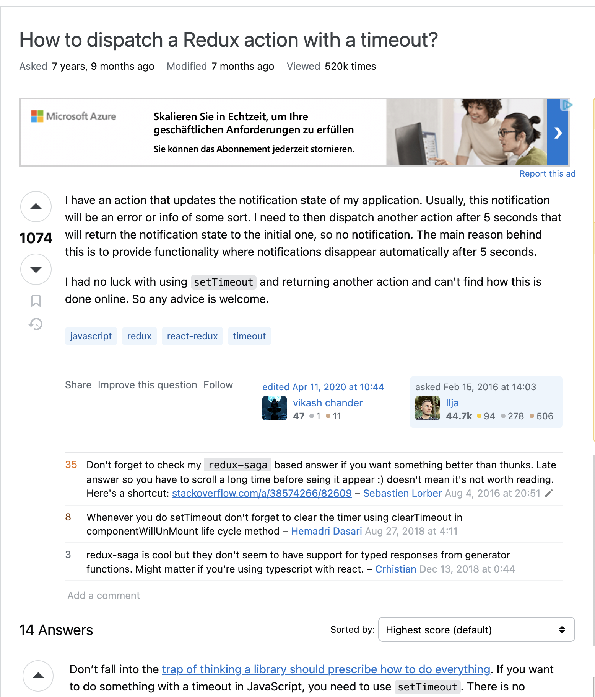

# Steps 8

Ziel: Schreibt eine minimalsten Stackoverflow-Clone von Scratch.

- Erzeugt für jedes Zwischenziel (mindestens) einen eigenen Commit. Nutze Tags oder Branches die nach den Zwischenzielen benannt sind um den fertigen Zustand zu dokumentieren.
- Ignoriert alles rund um Nutzer und Reputation. Jeder Post, Vote, Kommentar kann/sollte anonymn sein.
- Hauptseite zeigt eine Liste geposteter Fragen mit der Anzahl der Votes 
- Frageseite auf der die Frage, die Antworten sortiert nach Votes angezeigt werden samt Kommentaren. 
- Up / Downvoting von Fragen und Kommentaren

Zwischenziele:

- Erzeuge ein öffentlichen Git-Repo (z.B. auf GitHub)
- [ZZ-01] NPM-Workspaces / Monorepo mit (mindestens) `packages/client` und `packages/server` (Unit 4 / Neu)
- [ZZ-02] Initialisiere das Frontend mit Vite `npm create vite@latest packages/client -- --template react-ts` (siehe Unit 3) und erzeuge die beiden Routen für Haupt und Frageseite mit React Router (siehe Unit 5)
- [ZZ-03] Erzeuge ein GraphQL Schema (erstmal nur Query) um die notwendigen Daten für Haupt-/Detailsseite abrufen zu können. (Unit 4)
  - Füge ApolloClient zum Projekt hinzu und mache die notwendigen Queries für beise Seiten.
  - Richte Graphql-Codegen so ein das fürs Frontend das "client-side-preset" genutzt wird und das "Resolver" für das Graphql Yoga Backend erzeugt werden
  - Implementiere die Resolver so das sie über einen DbContext die Daten aus MongoDB auslesen. (Unit 2)
  - Erzeuge in MongoDB einige Beispieldaten / Fakedaten (Unit 1)
- [ZZ-04] Implementiere alle Komponenten die zur Anzeige der Fakedaten (nur Query) notwendig sind. Teste mit Vitest & React Testing Library (RTL) um Komponenten zu testen und Playwright (PW) für E2E-tests. (Unit 7)
- [ZZ-05] Füge die Funktionität (Mutations) ein um neue Fragen hinzuzufügen, Antworten und Kommentare zu schreiben und Up/Downvoten zu können. Nutzt React-Hook-Forms für alle notwendigen Formulare (Unit 6)
